# Architecture Patterns Reference

**Document Version**: 1.0  
**Last Updated**: November 5, 2025  
**Project**: VSA Payment Gateway Demo

---

## Table of Contents

1. [Executive Summary](#executive-summary)
2. [Vertical Slice Architecture (VSA)](#vertical-slice-architecture-vsa)
3. [CQRS Pattern](#cqrs-pattern)
4. [Event Sourcing](#event-sourcing)
5. [Saga Pattern](#saga-pattern)
6. [Event-Driven Architecture](#event-driven-architecture)
7. [Pattern Comparison Matrix](#pattern-comparison-matrix)
8. [Architecture Decision Records](#architecture-decision-records)
9. [Implementation Guidelines](#implementation-guidelines)
10. [Best Practices](#best-practices)

---

## Executive Summary

This document serves as a comprehensive reference for the architectural patterns used in the VSA Payment Gateway project. It provides detailed explanations of each pattern, compares them with alternative approaches, and offers guidance for implementation.

### Why These Patterns?

The payment gateway domain requires:
- **High Reliability**: No lost transactions
- **Auditability**: Complete transaction history
- **Scalability**: Handle millions of transactions
- **Consistency**: Eventual consistency across services
- **Resilience**: Graceful degradation and recovery

Our architecture addresses these requirements through:
- **VSA**: Feature-focused organization
- **CQRS**: Optimized read/write models
- **Event Sourcing**: Complete audit trail
- **Saga Pattern**: Distributed transaction coordination
- **Event-Driven**: Loose coupling and scalability

---

## Vertical Slice Architecture (VSA)

### Overview

Vertical Slice Architecture organizes code by **features** rather than technical layers, where each feature is a complete vertical slice from UI to database.

### Core Principles

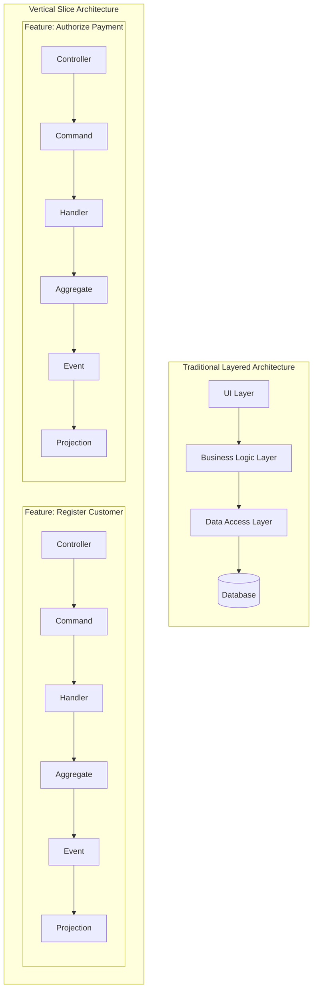

### VSA Implementation in Payment Gateway

#### Structure

```
customer-service/
├── features/
│   ├── register-customer/
│   │   ├── api/
│   │   │   └── CustomerController.java
│   │   ├── commands/
│   │   │   └── RegisterCustomerCommand.java
│   │   ├── events/
│   │   │   └── CustomerRegisteredEvent.java
│   │   ├── aggregates/
│   │   │   └── CustomerAggregate.java
│   │   ├── projections/
│   │   │   ├── CustomerReadModel.java
│   │   │   └── CustomerProjection.java
│   │   └── validators/
│   │       └── CustomerValidator.java
│   │
│   ├── add-payment-method/
│   │   ├── api/
│   │   ├── commands/
│   │   ├── events/
│   │   ├── aggregates/
│   │   └── projections/
│   │
│   └── query-customer/
│       ├── api/
│       └── projections/
│
└── shared/
    ├── config/
    ├── exceptions/
    └── utils/
```

#### Example: Register Customer Feature

```java
// 1. API Controller
@RestController
@RequestMapping("/api/customers")
public class CustomerController {
    
    @PostMapping("/register")
    public ResponseEntity<String> register(@RequestBody RegisterCustomerRequest request) {
        String customerId = commandGateway.sendAndWait(
            new RegisterCustomerCommand(
                UUID.randomUUID().toString(),
                request.getName(),
                request.getEmail(),
                request.getPhone()
            )
        );
        return ResponseEntity.created(URI.create("/api/customers/" + customerId))
                             .body(customerId);
    }
}

// 2. Command
public record RegisterCustomerCommand(
    @TargetAggregateIdentifier String customerId,
    String name,
    String email,
    String phone
) {}

// 3. Aggregate
@Aggregate
public class CustomerAggregate {
    
    @AggregateIdentifier
    private String customerId;
    private String name;
    private String email;
    
    @CommandHandler
    public CustomerAggregate(RegisterCustomerCommand command) {
        // Validation
        if (!EmailValidator.isValid(command.email())) {
            throw new InvalidEmailException();
        }
        
        // Apply event
        apply(new CustomerRegisteredEvent(
            command.customerId(),
            command.name(),
            command.email(),
            command.phone()
        ));
    }
    
    @EventSourcingHandler
    public void on(CustomerRegisteredEvent event) {
        this.customerId = event.customerId();
        this.name = event.name();
        this.email = event.email();
    }
}

// 4. Event
public record CustomerRegisteredEvent(
    String customerId,
    String name,
    String email,
    String phone,
    Instant registeredAt
) {}

// 5. Projection (Read Model)
@Component
public class CustomerProjection {
    
    @EventHandler
    public void on(CustomerRegisteredEvent event) {
        CustomerReadModel readModel = new CustomerReadModel();
        readModel.setCustomerId(event.customerId());
        readModel.setName(event.name());
        readModel.setEmail(event.email());
        readModel.setPhone(event.phone());
        
        repository.save(readModel);
    }
}
```

### VSA Benefits

| Benefit | Description | Impact |
|---------|-------------|--------|
| **Feature Cohesion** | All code for a feature in one place | Faster development, easier maintenance |
| **Independent Deployment** | Features can be deployed independently | Reduced risk, faster releases |
| **Team Autonomy** | Teams own complete features | Parallel development, clear ownership |
| **Easy Testing** | Test entire feature vertically | Better test coverage, fewer integration issues |
| **Bounded Complexity** | Each slice is simple | Reduced cognitive load |

### Comparison with Traditional Layered Architecture

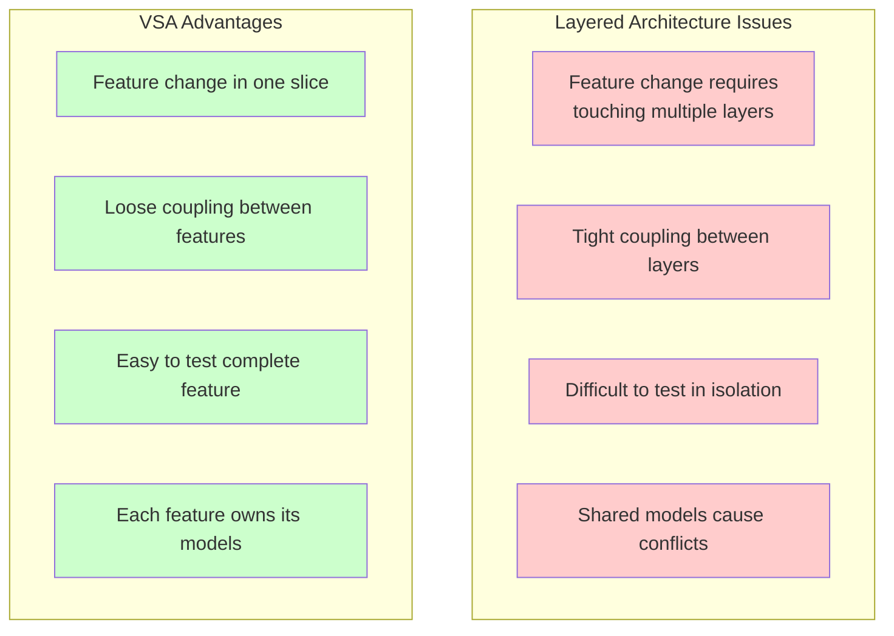

### When to Use VSA

✅ **Use VSA when:**
- Building feature-rich applications
- Teams need autonomy
- Features have clear boundaries
- Rapid development is priority
- Domain complexity is moderate to high

❌ **Avoid VSA when:**
- Application has few features
- Lots of shared logic across features
- Team is very small (<3 developers)
- Domain is extremely simple (CRUD only)

---

## CQRS Pattern

### Overview

**Command Query Responsibility Segregation (CQRS)** separates read and write operations into different models, optimizing each for its specific purpose.

### Architecture

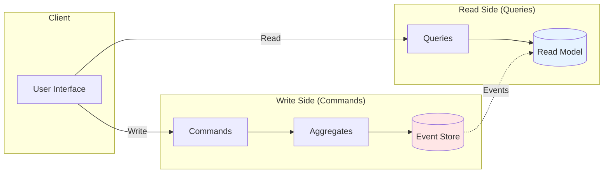

### Implementation in Payment Gateway

#### Write Model (Commands)

```java
// Command: Intent to change state
public record AuthorizePaymentCommand(
    @TargetAggregateIdentifier String authorizationId,
    String paymentMethodId,
    BigDecimal amount,
    String currency,
    String merchantId
) {}

// Aggregate: Business logic and state
@Aggregate
public class PaymentAuthorizationAggregate {
    
    @AggregateIdentifier
    private String authorizationId;
    private BigDecimal amount;
    private AuthorizationStatus status;
    
    @CommandHandler
    public PaymentAuthorizationAggregate(AuthorizePaymentCommand command) {
        // Business validation
        if (command.amount().compareTo(BigDecimal.ZERO) <= 0) {
            throw new InvalidAmountException();
        }
        
        // Risk assessment
        RiskScore riskScore = riskEngine.assess(command);
        if (riskScore.isHigh()) {
            apply(new PaymentAuthorizationFailedEvent(
                command.authorizationId(),
                "HIGH_RISK"
            ));
            return;
        }
        
        // Authorize payment
        apply(new PaymentAuthorizedEvent(
            command.authorizationId(),
            command.paymentMethodId(),
            command.amount(),
            command.currency(),
            riskScore.getValue()
        ));
    }
    
    @EventSourcingHandler
    public void on(PaymentAuthorizedEvent event) {
        this.authorizationId = event.authorizationId();
        this.amount = event.amount();
        this.status = AuthorizationStatus.AUTHORIZED;
    }
}
```

#### Read Model (Queries)

```java
// Read Model: Optimized for queries
@Entity
@Table(name = "authorization_read_model")
public class AuthorizationReadModel {
    @Id
    private String authorizationId;
    private String paymentMethodId;
    private String customerId;
    private String customerName;
    private String cardLast4;
    private BigDecimal amount;
    private String currency;
    private String status;
    private Double riskScore;
    private Instant authorizedAt;
    private Instant expiresAt;
    
    // Denormalized for query performance
    // Includes customer name, card last 4, etc.
}

// Query Repository
public interface AuthorizationReadModelRepository 
    extends JpaRepository<AuthorizationReadModel, String> {
    
    List<AuthorizationReadModel> findByCustomerId(String customerId);
    
    List<AuthorizationReadModel> findByStatus(String status);
    
    @Query("SELECT a FROM AuthorizationReadModel a WHERE " +
           "a.authorizedAt >= :startDate AND a.status = 'AUTHORIZED'")
    List<AuthorizationReadModel> findRecentAuthorizations(
        @Param("startDate") Instant startDate
    );
}

// Query Handler
@Component
public class AuthorizationQueryHandler {
    
    @QueryHandler
    public AuthorizationReadModel handle(GetAuthorizationQuery query) {
        return repository.findById(query.authorizationId())
                         .orElseThrow(() -> new AuthorizationNotFoundException());
    }
    
    @QueryHandler
    public List<AuthorizationReadModel> handle(GetCustomerAuthorizationsQuery query) {
        return repository.findByCustomerId(query.customerId());
    }
}
```

#### Projection: Write → Read Synchronization

```java
@Component
public class AuthorizationProjection {
    
    @EventHandler
    public void on(PaymentAuthorizedEvent event) {
        // Fetch additional data for denormalization
        CustomerReadModel customer = customerRepository.findById(event.customerId());
        PaymentMethodReadModel paymentMethod = paymentMethodRepository.findById(event.paymentMethodId());
        
        // Create optimized read model
        AuthorizationReadModel readModel = new AuthorizationReadModel();
        readModel.setAuthorizationId(event.authorizationId());
        readModel.setPaymentMethodId(event.paymentMethodId());
        readModel.setCustomerId(customer.getCustomerId());
        readModel.setCustomerName(customer.getName()); // Denormalized
        readModel.setCardLast4(paymentMethod.getCardLast4()); // Denormalized
        readModel.setAmount(event.amount());
        readModel.setCurrency(event.currency());
        readModel.setStatus("AUTHORIZED");
        readModel.setRiskScore(event.riskScore());
        readModel.setAuthorizedAt(event.authorizedAt());
        readModel.setExpiresAt(event.authorizedAt().plus(Duration.ofHours(1)));
        
        repository.save(readModel);
    }
}
```

### CQRS Benefits

| Aspect | Write Model | Read Model |
|--------|-------------|------------|
| **Purpose** | Business logic, validation | Query optimization |
| **Structure** | Normalized, event-sourced | Denormalized, flat |
| **Consistency** | Strongly consistent | Eventually consistent |
| **Scalability** | Moderate | High (read replicas) |
| **Complexity** | High (business rules) | Low (simple queries) |

### CQRS vs Traditional CRUD

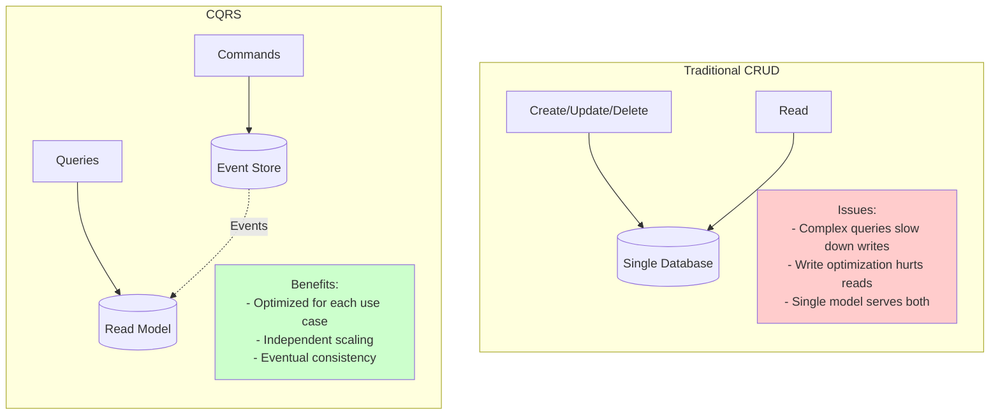

### When to Use CQRS

✅ **Use CQRS when:**
- Read and write workloads differ significantly
- Complex business logic on writes
- Need to scale reads independently
- Reporting requirements differ from transactional needs
- Event sourcing is used

❌ **Avoid CQRS when:**
- Simple CRUD operations
- Reads and writes are similar
- Eventually consistent reads are problematic
- Team lacks experience with the pattern

---

## Event Sourcing

### Overview

**Event Sourcing** stores all changes to application state as a sequence of events, rather than just the current state.

### Core Concept

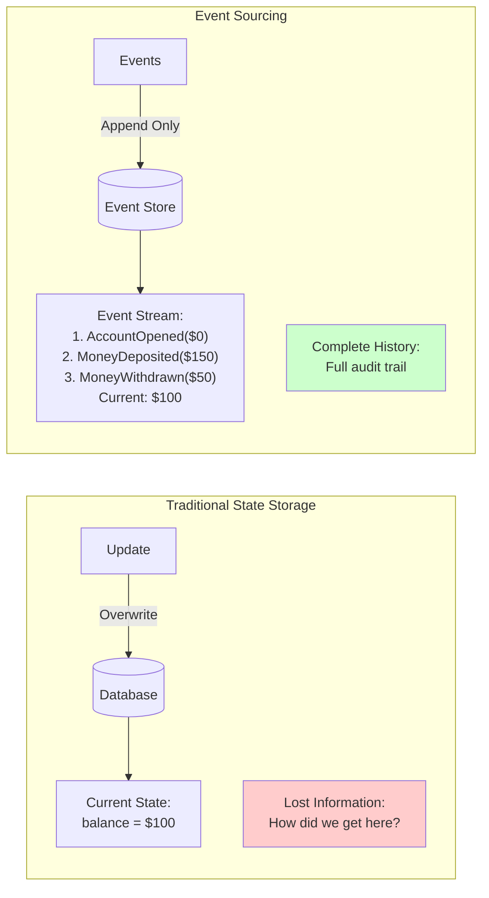

### Implementation

#### Event Store Schema

```sql
-- Axon Framework event store
CREATE TABLE domain_event_entry (
    global_index BIGSERIAL PRIMARY KEY,
    event_identifier VARCHAR(255) NOT NULL UNIQUE,
    aggregate_identifier VARCHAR(255) NOT NULL,
    sequence_number BIGINT NOT NULL,
    type VARCHAR(255) NOT NULL,
    timestamp VARCHAR(255) NOT NULL,
    payload_type VARCHAR(255) NOT NULL,
    payload TEXT NOT NULL,
    meta_data TEXT,
    UNIQUE(aggregate_identifier, sequence_number)
);

CREATE INDEX idx_aggregate ON domain_event_entry(aggregate_identifier, sequence_number);
CREATE INDEX idx_timestamp ON domain_event_entry(timestamp);
```

#### Event Stream Example

```json
// Customer Aggregate: c7f4e8a0-9b2d-4e5f-8a1c-3d6e9f2b5c8a

// Event 0: Customer registered
{
  "eventIdentifier": "evt-001",
  "aggregateIdentifier": "c7f4e8a0-9b2d-4e5f-8a1c-3d6e9f2b5c8a",
  "sequenceNumber": 0,
  "type": "CustomerRegisteredEvent",
  "timestamp": "2025-11-05T10:00:00.000Z",
  "payload": {
    "customerId": "c7f4e8a0-9b2d-4e5f-8a1c-3d6e9f2b5c8a",
    "name": "John Doe",
    "email": "john@example.com",
    "phone": "+1-555-0123"
  }
}

// Event 1: Payment method added
{
  "eventIdentifier": "evt-002",
  "aggregateIdentifier": "c7f4e8a0-9b2d-4e5f-8a1c-3d6e9f2b5c8a",
  "sequenceNumber": 1,
  "type": "PaymentMethodAddedEvent",
  "timestamp": "2025-11-05T10:05:00.000Z",
  "payload": {
    "paymentMethodId": "pm-123",
    "customerId": "c7f4e8a0-9b2d-4e5f-8a1c-3d6e9f2b5c8a",
    "cardLast4": "9010",
    "cardBrand": "VISA"
  }
}

// Event 2: Payment method removed
{
  "eventIdentifier": "evt-003",
  "aggregateIdentifier": "c7f4e8a0-9b2d-4e5f-8a1c-3d6e9f2b5c8a",
  "sequenceNumber": 2,
  "type": "PaymentMethodRemovedEvent",
  "timestamp": "2025-11-05T11:00:00.000Z",
  "payload": {
    "paymentMethodId": "pm-123",
    "customerId": "c7f4e8a0-9b2d-4e5f-8a1c-3d6e9f2b5c8a",
    "reason": "EXPIRED"
  }
}
```

#### State Reconstruction

```java
@Aggregate
public class CustomerAggregate {
    
    @AggregateIdentifier
    private String customerId;
    private String name;
    private String email;
    private List<String> paymentMethodIds = new ArrayList<>();
    
    // When loading from event store, replay all events
    public static CustomerAggregate reconstruct(String aggregateId) {
        // Axon automatically loads events and replays them
        // Events applied in order: 0, 1, 2, ...
    }
    
    @EventSourcingHandler
    public void on(CustomerRegisteredEvent event) {
        this.customerId = event.customerId();
        this.name = event.name();
        this.email = event.email();
    }
    
    @EventSourcingHandler
    public void on(PaymentMethodAddedEvent event) {
        this.paymentMethodIds.add(event.paymentMethodId());
    }
    
    @EventSourcingHandler
    public void on(PaymentMethodRemovedEvent event) {
        this.paymentMethodIds.remove(event.paymentMethodId());
    }
    
    // Current state = result of replaying all events
}
```

### Event Sourcing Benefits

| Benefit | Description | Use Case |
|---------|-------------|----------|
| **Complete Audit Trail** | Every state change recorded | Regulatory compliance, fraud investigation |
| **Temporal Queries** | Query state at any point in time | "What was balance on Oct 1?" |
| **Event Replay** | Rebuild state from events | Debugging, testing, disaster recovery |
| **Business Intelligence** | Analyze event patterns | Fraud detection, customer behavior |
| **Immutability** | Events never change | Reliable audit log |
| **Debugging** | See exact sequence of changes | Root cause analysis |

### Event Sourcing Challenges

| Challenge | Solution |
|-----------|----------|
| **Event Schema Evolution** | Use event versioning and upcasters |
| **Performance** | Snapshots for aggregates with many events |
| **Storage Growth** | Event archiving and compression |
| **Query Complexity** | CQRS with optimized read models |
| **Eventual Consistency** | Design UI for async updates |

### Snapshots

```java
// For aggregates with many events, use snapshots
@Aggregate(snapshotTriggerDefinition = "snapshotTrigger")
public class CustomerAggregate {
    
    @AggregateIdentifier
    private String customerId;
    private String name;
    private List<String> paymentMethodIds;
    
    // Snapshot created every 100 events
    // Next load: restore from snapshot + replay events since snapshot
}

@Configuration
public class SnapshotConfiguration {
    
    @Bean
    public SnapshotTriggerDefinition snapshotTrigger() {
        return new EventCountSnapshotTriggerDefinition(
            Snapshotter.class,
            100 // Snapshot every 100 events
        );
    }
}
```

### Event Store vs Traditional Database

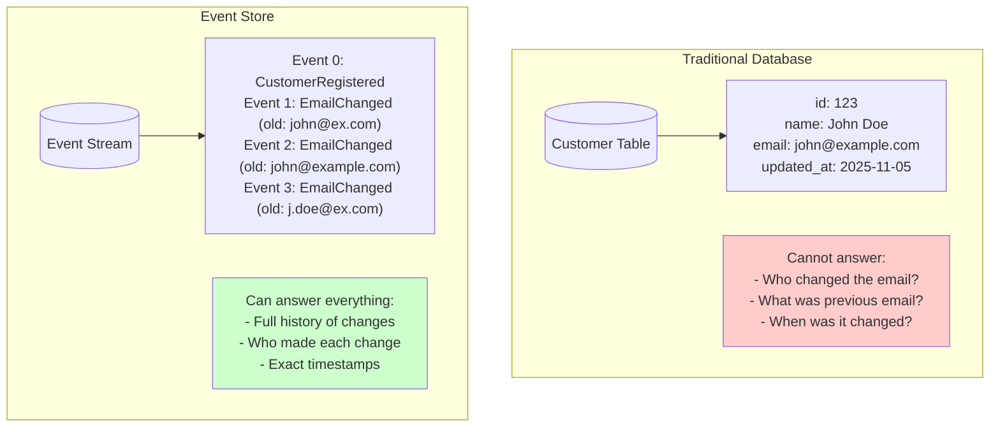

### When to Use Event Sourcing

✅ **Use Event Sourcing when:**
- Audit trail is critical (financial, healthcare)
- Need to replay events for testing/debugging
- Temporal queries required ("state at time T")
- Event-driven architecture is used
- Complex business logic with many state changes

❌ **Avoid Event Sourcing when:**
- Simple CRUD operations
- Audit trail not important
- Team lacks experience
- Performance critical reads (without CQRS)
- Storage is severely constrained

---

## Saga Pattern

### Overview

**Saga Pattern** manages distributed transactions across microservices using a sequence of local transactions coordinated by events.

### Choreography vs Orchestration

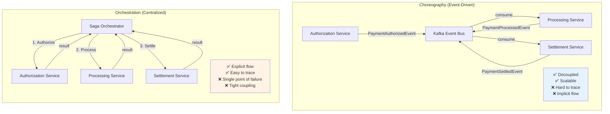

### Implementation: Payment Saga (Choreography)

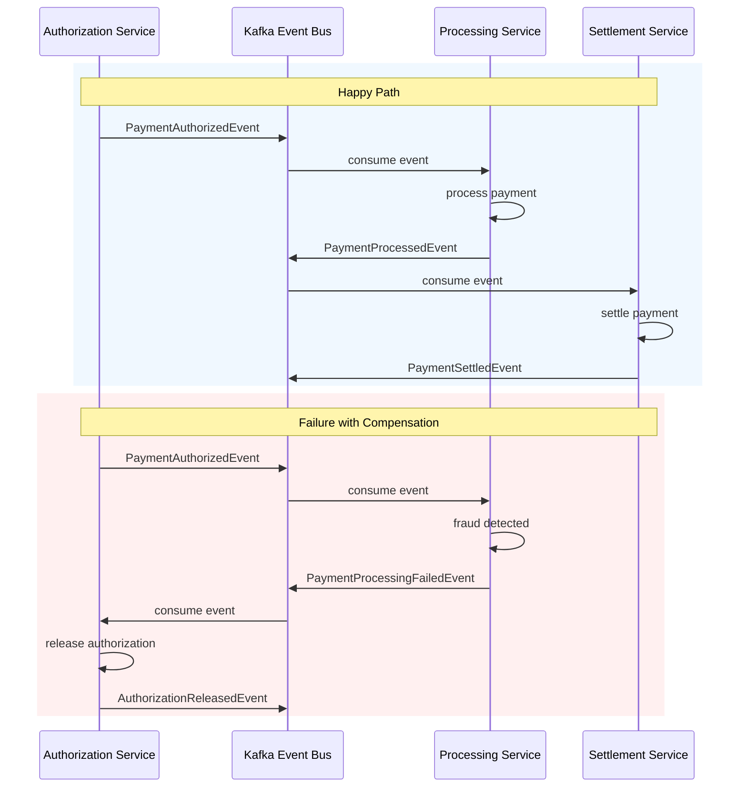

### Compensation Logic

```java
// Processing Service: Handle failures and trigger compensation
@Component
public class PaymentProcessingSaga {
    
    @EventHandler
    public void on(PaymentAuthorizedEvent event) {
        try {
            // Attempt processing
            ProcessPaymentCommand command = new ProcessPaymentCommand(
                event.authorizationId(),
                event.paymentMethodId(),
                event.amount()
            );
            
            String processingId = commandGateway.sendAndWait(command);
            
        } catch (FraudDetectedException e) {
            // Compensation: Release authorization
            commandGateway.send(new ReleaseAuthorizationCommand(
                event.authorizationId(),
                "FRAUD_DETECTED"
            ));
        } catch (PaymentNetworkException e) {
            // Compensation: Release authorization
            commandGateway.send(new ReleaseAuthorizationCommand(
                event.authorizationId(),
                "NETWORK_ERROR"
            ));
        }
    }
}

// Authorization Service: Handle compensation
@Aggregate
public class PaymentAuthorizationAggregate {
    
    @CommandHandler
    public void handle(ReleaseAuthorizationCommand command) {
        // Only release if currently authorized
        if (this.status != AuthorizationStatus.AUTHORIZED) {
            throw new InvalidStateException();
        }
        
        apply(new AuthorizationReleasedEvent(
            command.authorizationId(),
            command.reason()
        ));
    }
    
    @EventSourcingHandler
    public void on(AuthorizationReleasedEvent event) {
        this.status = AuthorizationStatus.RELEASED;
    }
}
```

### Saga State Machine

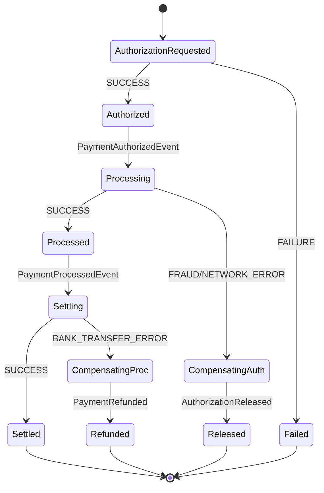

### Idempotency

```java
// Ensure saga steps can be safely retried
@Component
public class PaymentProcessingSaga {
    
    @EventHandler
    public void on(PaymentAuthorizedEvent event, 
                   @MetaDataValue("message-id") String messageId) {
        
        // Check if already processed (idempotency)
        if (processedMessageRepository.exists(messageId)) {
            log.info("Message {} already processed, skipping", messageId);
            return;
        }
        
        try {
            // Process payment
            ProcessPaymentCommand command = new ProcessPaymentCommand(
                event.authorizationId(),
                event.paymentMethodId(),
                event.amount()
            );
            
            String processingId = commandGateway.sendAndWait(command);
            
            // Mark as processed
            processedMessageRepository.save(new ProcessedMessage(messageId));
            
        } catch (Exception e) {
            // Trigger compensation
            compensate(event);
        }
    }
}
```

### Saga vs Distributed Transactions (2PC)

| Aspect | Saga Pattern | Two-Phase Commit (2PC) |
|--------|--------------|------------------------|
| **Consistency** | Eventually consistent | Strongly consistent |
| **Locking** | No distributed locks | Distributed locks |
| **Performance** | High | Low (blocking) |
| **Scalability** | High | Low |
| **Complexity** | High (compensation logic) | Low (framework handles it) |
| **Failure Handling** | Compensation transactions | Rollback |
| **Availability** | High (services independent) | Low (coordinator dependency) |
| **Use Case** | Microservices | Monoliths, tight coupling OK |

### When to Use Saga Pattern

✅ **Use Saga when:**
- Distributed transactions across microservices
- High availability required
- Services are autonomous
- Eventual consistency acceptable
- Long-running business processes

❌ **Avoid Saga when:**
- Single database/monolith
- Strong consistency required immediately
- Simple transactions
- Team lacks experience with distributed systems

---

## Event-Driven Architecture

### Overview

**Event-Driven Architecture (EDA)** uses events to trigger and communicate between decoupled services.

### Architecture Layers

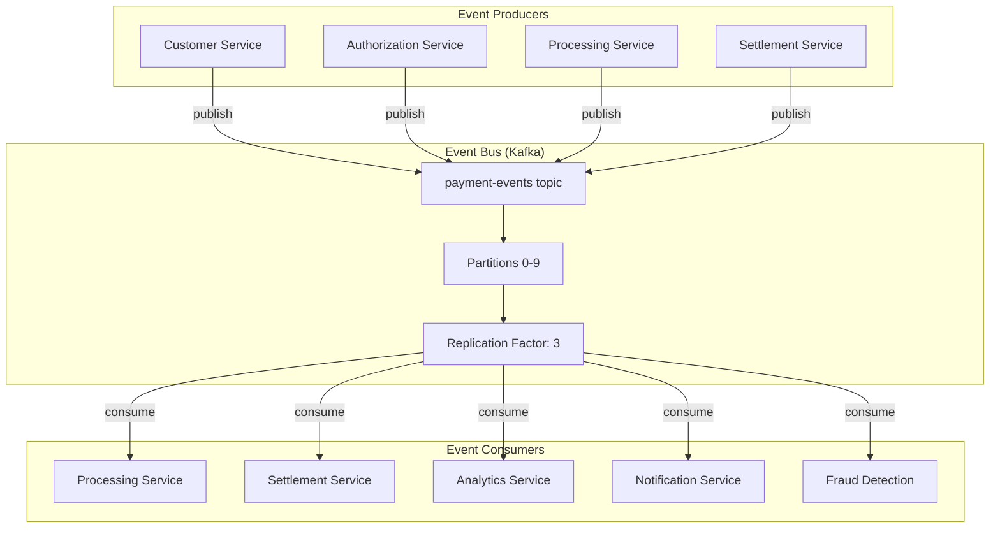

### Event Types

#### 1. Domain Events

```java
// Business-significant events
public record CustomerRegisteredEvent(
    String customerId,
    String name,
    String email,
    Instant registeredAt
) {}

public record PaymentAuthorizedEvent(
    String authorizationId,
    String paymentMethodId,
    BigDecimal amount,
    Double riskScore,
    Instant authorizedAt
) {}
```

#### 2. Integration Events

```java
// Events for cross-service communication
public record PaymentCompletedIntegrationEvent(
    String paymentId,
    String customerId,
    String merchantId,
    BigDecimal amount,
    String status,
    Instant completedAt
) {}
```

#### 3. System Events

```java
// Infrastructure events
public record ServiceHealthCheckEvent(
    String serviceName,
    String status,
    Map<String, Object> metrics,
    Instant timestamp
) {}
```

### Event Publishing

```java
@Component
public class EventToKafkaForwarder {
    
    private final KafkaTemplate<String, String> kafkaTemplate;
    private final ObjectMapper objectMapper;
    private final String topic;
    
    @EventHandler
    public void on(Object event) {
        // Filter Axon internal events
        String className = event.getClass().getName();
        if (className.startsWith("org.axonframework.") || 
            className.contains("UnknownSerializedType")) {
            return;
        }
        
        try {
            // Serialize event
            String json = objectMapper.writeValueAsString(event);
            
            // Publish to Kafka
            String key = event.getClass().getSimpleName();
            kafkaTemplate.send(topic, key, json);
            
            log.info("Published event to Kafka: {}", key);
            
        } catch (Exception e) {
            log.error("Failed to publish event to Kafka", e);
            // Consider: Dead Letter Queue (DLQ)
        }
    }
}
```

### Event Consumption

```java
@Component
public class PaymentEventConsumer {
    
    @KafkaListener(
        topics = "${axon.kafka.default-topic}",
        groupId = "processing-service-group",
        containerFactory = "kafkaListenerContainerFactory"
    )
    public void consumePaymentEvents(
        @Payload String eventJson,
        @Header(KafkaHeaders.RECEIVED_KEY) String eventType,
        @Header(KafkaHeaders.RECEIVED_PARTITION_ID) int partition
    ) {
        try {
            log.info("Received event: {} from partition: {}", eventType, partition);
            
            // Deserialize
            Class<?> eventClass = Class.forName(eventType);
            Object event = objectMapper.readValue(eventJson, eventClass);
            
            // Process event
            if (event instanceof PaymentAuthorizedEvent authorizedEvent) {
                processAuthorizedPayment(authorizedEvent);
            }
            
        } catch (Exception e) {
            log.error("Error processing event", e);
            // Send to DLQ or retry
        }
    }
    
    private void processAuthorizedPayment(PaymentAuthorizedEvent event) {
        ProcessPaymentCommand command = new ProcessPaymentCommand(
            event.authorizationId(),
            event.paymentMethodId(),
            event.amount()
        );
        
        commandGateway.send(command);
    }
}
```

### Event Ordering Guarantees

```mermaid
flowchart LR
    subgraph "Kafka Partitioning"
        E1[Event: customerId=123]
        E2[Event: customerId=456]
        E3[Event: customerId=123]
        E4[Event: customerId=789]
        
        P0[Partition 0]
        P1[Partition 1]
        P2[Partition 2]
        
        E1 -->|hash(123) % 3 = 0| P0
        E2 -->|hash(456) % 3 = 1| P1
        E3 -->|hash(123) % 3 = 0| P0
        E4 -->|hash(789) % 3 = 2| P2
    end
    
    subgraph "Ordering Guarantee"
        G1["✅ Events for customerId=123<br/>ordered in Partition 0"]
        G2["✅ Events for customerId=456<br/>ordered in Partition 1"]
        G3["❌ No ordering guarantee<br/>across partitions"]
    end
    
    P0 --> G1
    P1 --> G2
    P2 --> G3
```

### Error Handling Strategies

#### 1. Retry with Exponential Backoff

```java
@Configuration
public class KafkaErrorHandlingConfig {
    
    @Bean
    public DefaultErrorHandler errorHandler() {
        // Retry configuration
        FixedBackOff backOff = new FixedBackOff(1000L, 3L); // 1s delay, 3 retries
        
        DefaultErrorHandler errorHandler = new DefaultErrorHandler(
            (record, exception) -> {
                // After all retries failed, send to DLQ
                dlqProducer.send("payment-events-dlq", record);
            },
            backOff
        );
        
        // Don't retry on certain exceptions
        errorHandler.addNotRetryableExceptions(
            JsonProcessingException.class,
            InvalidEventException.class
        );
        
        return errorHandler;
    }
}
```

#### 2. Dead Letter Queue (DLQ)

```java
@Component
public class DeadLetterQueueHandler {
    
    @KafkaListener(topics = "payment-events-dlq")
    public void handleDLQ(
        @Payload String eventJson,
        @Header(KafkaHeaders.EXCEPTION_MESSAGE) String error
    ) {
        log.error("Event in DLQ. Error: {}, Event: {}", error, eventJson);
        
        // Alert operations team
        alertService.sendAlert("DLQ Event", error, eventJson);
        
        // Store for manual processing
        dlqRepository.save(new DLQRecord(eventJson, error));
    }
}
```

### Event-Driven vs Request-Response

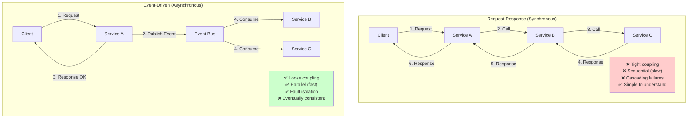

### Event Sourcing + CQRS + Event-Driven

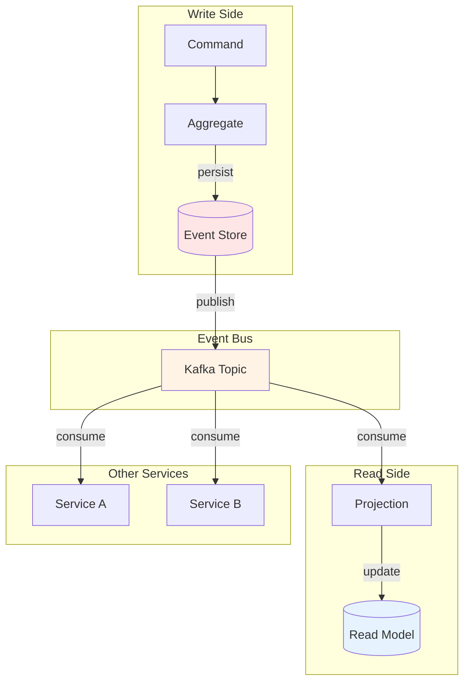

### When to Use Event-Driven Architecture

✅ **Use EDA when:**
- Microservices need to communicate
- Loose coupling is priority
- Asynchronous processing acceptable
- Need to scale independently
- Multiple consumers of same events
- Building reactive systems

❌ **Avoid EDA when:**
- Strong consistency required immediately
- Simple request-response is sufficient
- Real-time synchronous responses needed
- Team lacks distributed systems experience
- Infrastructure for messaging not available

---

## Pattern Comparison Matrix

### Comprehensive Comparison

| Pattern | Complexity | Scalability | Consistency | Auditability | Learning Curve | Best For |
|---------|-----------|-------------|-------------|--------------|----------------|----------|
| **VSA** | Medium | High | N/A | Medium | Low | Feature-rich apps |
| **CQRS** | Medium-High | Very High | Eventual | Medium | Medium | Read-heavy workloads |
| **Event Sourcing** | High | High | Strong (write) | Very High | High | Audit-critical systems |
| **Saga** | High | High | Eventual | Medium | High | Distributed transactions |
| **Event-Driven** | Medium-High | Very High | Eventual | High | Medium-High | Microservices |
| **Layered** | Low | Low | Strong | Low | Very Low | Simple CRUD apps |
| **Monolith** | Low-Medium | Low | Strong | Low | Low | Small apps, MVPs |

### Decision Matrix

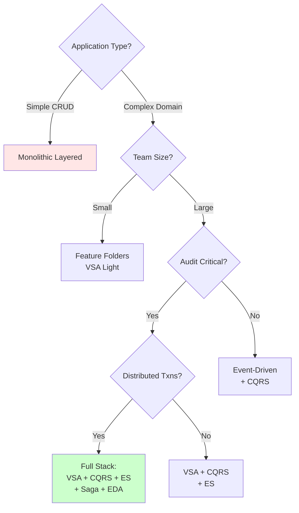

---

## Architecture Decision Records

### ADR-001: Use Vertical Slice Architecture

**Status**: Accepted  
**Date**: 2025-10-01

**Context**:
The payment gateway has multiple distinct features (customer management, authorization, processing, settlement) with different business logic and requirements.

**Decision**:
Organize code by features (vertical slices) rather than technical layers.

**Consequences**:
- ✅ Each feature is self-contained and independently deployable
- ✅ Teams can work on features in parallel without conflicts
- ✅ Easier to understand feature flow from API to database
- ❌ Some code duplication across features (accepted trade-off)
- ❌ Requires discipline to avoid cross-feature dependencies

**Alternatives Considered**:
1. **Layered Architecture**: Rejected due to tight coupling across features
2. **Domain-Driven Design (DDD)**: Too complex for current team size

---

### ADR-002: Use CQRS Pattern

**Status**: Accepted  
**Date**: 2025-10-05

**Context**:
Read and write operations have different requirements:
- **Writes**: Complex business logic, strong consistency
- **Reads**: Simple queries, denormalized data, high performance

**Decision**:
Separate read and write models using CQRS pattern.

**Consequences**:
- ✅ Optimized write model for business logic
- ✅ Optimized read model for query performance
- ✅ Can scale reads and writes independently
- ❌ Eventual consistency between models
- ❌ Increased complexity (two models to maintain)

**Alternatives Considered**:
1. **Single Model**: Rejected due to conflicting optimization needs
2. **Database Views**: Rejected due to limited flexibility

---

### ADR-003: Use Event Sourcing for Aggregates

**Status**: Accepted  
**Date**: 2025-10-10

**Context**:
Payment gateway requires:
- Complete audit trail for regulatory compliance
- Ability to replay transactions for debugging
- Temporal queries (state at specific time)

**Decision**:
Use event sourcing for all aggregates (Customer, Authorization, Processing, Settlement).

**Consequences**:
- ✅ Complete audit trail of all state changes
- ✅ Can rebuild state from events for debugging
- ✅ Enables temporal queries
- ✅ Natural fit with event-driven architecture
- ❌ Cannot delete events (GDPR concern, addressed with encryption)
- ❌ Performance overhead (mitigated with snapshots)

**Alternatives Considered**:
1. **State-Based Storage**: Rejected due to lack of audit trail
2. **Change Data Capture (CDC)**: Rejected due to complexity

---

### ADR-004: Use Kafka for Event Bus

**Status**: Accepted  
**Date**: 2025-10-15

**Context**:
Need reliable, scalable event streaming between microservices.

**Decision**:
Use Apache Kafka as event bus for cross-service communication.

**Consequences**:
- ✅ High throughput (millions of events/sec)
- ✅ Durable (events persisted to disk)
- ✅ Scalable (horizontal partitioning)
- ✅ Replay capability
- ❌ Operational complexity (ZooKeeper dependency)
- ❌ Learning curve for team

**Alternatives Considered**:
1. **RabbitMQ**: Rejected due to lower throughput
2. **AWS SQS**: Rejected to avoid cloud lock-in
3. **Database as Event Store**: Rejected due to scalability concerns

---

### ADR-005: Use Saga Choreography Pattern

**Status**: Accepted  
**Date**: 2025-10-20

**Context**:
Payment flow requires coordination across 4 services: Customer → Authorization → Processing → Settlement.

**Decision**:
Use saga choreography pattern with event-driven communication.

**Consequences**:
- ✅ Services are decoupled
- ✅ No single point of failure
- ✅ Scalable
- ❌ Harder to trace complete flow
- ❌ Implicit business process (documented in flowcharts)

**Alternatives Considered**:
1. **Saga Orchestration**: Rejected due to tight coupling and SPOF
2. **Distributed Transactions (2PC)**: Rejected due to poor scalability

---

## Implementation Guidelines

### 1. Starting a New Feature (VSA)

```bash
# Create feature structure
payment-gateway-service/
└── features/
    └── authorize-payment/
        ├── api/
        │   └── AuthorizationController.java
        ├── commands/
        │   ├── AuthorizePaymentCommand.java
        │   └── ReleaseAuthorizationCommand.java
        ├── events/
        │   ├── PaymentAuthorizedEvent.java
        │   └── AuthorizationReleasedEvent.java
        ├── aggregates/
        │   └── PaymentAuthorizationAggregate.java
        ├── projections/
        │   ├── AuthorizationReadModel.java
        │   └── AuthorizationProjection.java
        └── services/
            └── RiskAssessmentService.java
```

### 2. Implementing CQRS

**Step 1**: Define command
```java
public record AuthorizePaymentCommand(
    @TargetAggregateIdentifier String authorizationId,
    String paymentMethodId,
    BigDecimal amount,
    String currency
) {}
```

**Step 2**: Implement aggregate
```java
@Aggregate
public class PaymentAuthorizationAggregate {
    @CommandHandler
    public PaymentAuthorizationAggregate(AuthorizePaymentCommand command) {
        // Validation + apply event
    }
}
```

**Step 3**: Create read model
```java
@Entity
public class AuthorizationReadModel {
    @Id
    private String authorizationId;
    // Denormalized fields
}
```

**Step 4**: Implement projection
```java
@Component
public class AuthorizationProjection {
    @EventHandler
    public void on(PaymentAuthorizedEvent event) {
        // Update read model
    }
}
```

### 3. Publishing Events to Kafka

```java
@Component
public class EventToKafkaForwarder {
    
    @EventHandler
    public void on(Object event) {
        // Filter internal events
        if (isInternalEvent(event)) return;
        
        // Serialize and publish
        String json = objectMapper.writeValueAsString(event);
        kafkaTemplate.send(topic, eventType, json);
    }
}
```

### 4. Consuming Events

```java
@Component
public class PaymentEventConsumer {
    
    @KafkaListener(topics = "payment-events")
    public void consume(@Payload String eventJson) {
        Object event = deserialize(eventJson);
        
        if (event instanceof PaymentAuthorizedEvent) {
            handleAuthorizedEvent((PaymentAuthorizedEvent) event);
        }
    }
}
```

### 5. Implementing Saga

```java
@Component
public class PaymentSaga {
    
    @EventHandler
    public void on(PaymentAuthorizedEvent event) {
        // Trigger processing
        commandGateway.send(new ProcessPaymentCommand(...));
    }
    
    @EventHandler
    public void on(PaymentProcessingFailedEvent event) {
        // Compensation: Release authorization
        commandGateway.send(new ReleaseAuthorizationCommand(...));
    }
}
```

---

## Best Practices

### Event Sourcing

✅ **DO**:
- Use immutable events
- Version events for schema evolution
- Implement snapshots for aggregates with many events
- Use correlation IDs for tracing
- Encrypt sensitive data in events

❌ **DON'T**:
- Modify existing events
- Store large binary data in events
- Use events for inter-aggregate communication (use Kafka)
- Expose internal event structure to clients

### CQRS

✅ **DO**:
- Denormalize read models aggressively
- Use different databases for reads/writes if needed
- Cache read models when appropriate
- Design read models for specific queries
- Accept eventual consistency

❌ **DON'T**:
- Query event store directly for reads
- Normalize read models
- Expect immediate consistency
- Reuse write model DTOs in read models

### Event-Driven

✅ **DO**:
- Make events immutable
- Include all necessary data in events (avoid lookups)
- Use idempotency keys
- Implement retry with exponential backoff
- Use DLQ for failed events
- Monitor event lag

❌ **DON'T**:
- Include sensitive data in event keys
- Create cyclic event dependencies
- Rely on event ordering across partitions
- Ignore duplicate events

### Saga Pattern

✅ **DO**:
- Design for idempotency
- Implement compensation logic
- Use timeouts for long-running sagas
- Monitor saga execution
- Log all saga steps

❌ **DON'T**:
- Create circular dependencies
- Forget compensation logic
- Rely on transaction rollback
- Ignore partial failures

---

## Summary

### Pattern Selection Guide

**For Small Applications (< 10 features)**:
- Monolithic layered architecture
- Single database
- Optional: CQRS for read-heavy features

**For Medium Applications (10-50 features)**:
- VSA within monolith
- CQRS for complex features
- Event-driven for async operations
- Consider modular monolith

**For Large Applications (> 50 features)**:
- Microservices with VSA
- CQRS + Event Sourcing
- Event-Driven Architecture
- Saga for distributed transactions
- **This is our payment gateway**

### Technology Choices

| Pattern | Technology | Alternative |
|---------|-----------|-------------|
| **Event Sourcing** | Axon Framework | EventStoreDB, custom |
| **Event Bus** | Apache Kafka | RabbitMQ, AWS SNS/SQS |
| **Database** | PostgreSQL | MySQL, MongoDB |
| **Serialization** | Jackson JSON | Avro, Protobuf |
| **API** | REST | GraphQL, gRPC |

### Success Metrics

| Metric | Target | Measurement |
|--------|--------|-------------|
| **Deployment Frequency** | Multiple/day | CD pipeline |
| **Lead Time** | < 1 day | Git commit → production |
| **MTTR** | < 1 hour | Incident logs |
| **Event Processing Lag** | < 1 second | Kafka metrics |
| **Read Model Latency** | < 100ms | APM tools |

---

**Document Status**: ✅ Complete  
**Maintained By**: Architecture Team  
**Review Cycle**: Quarterly  
**Next Review**: February 2026
