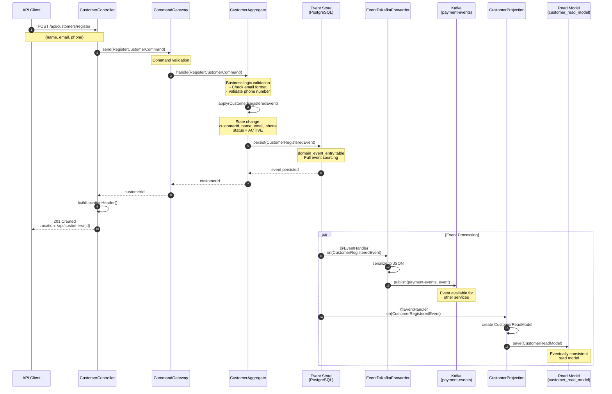
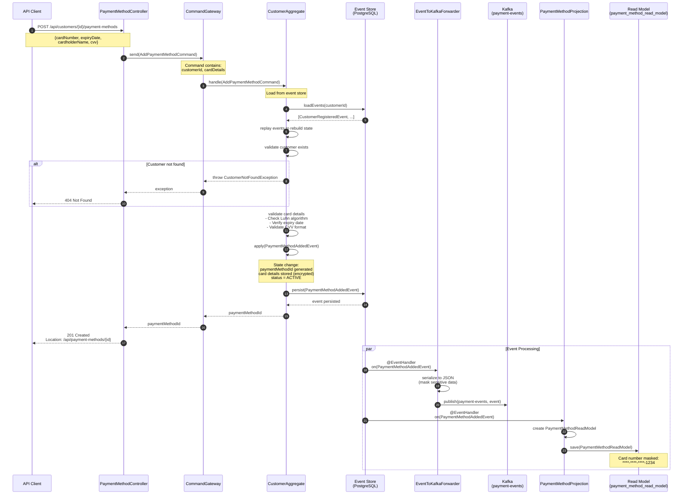
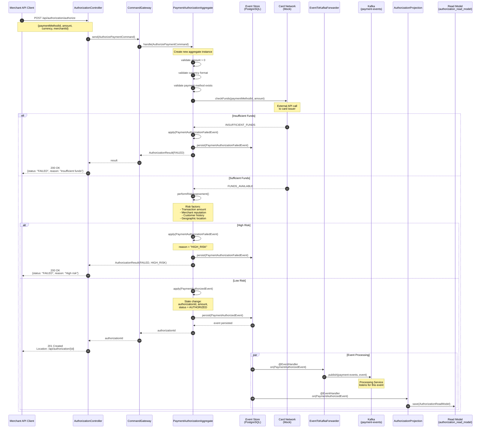
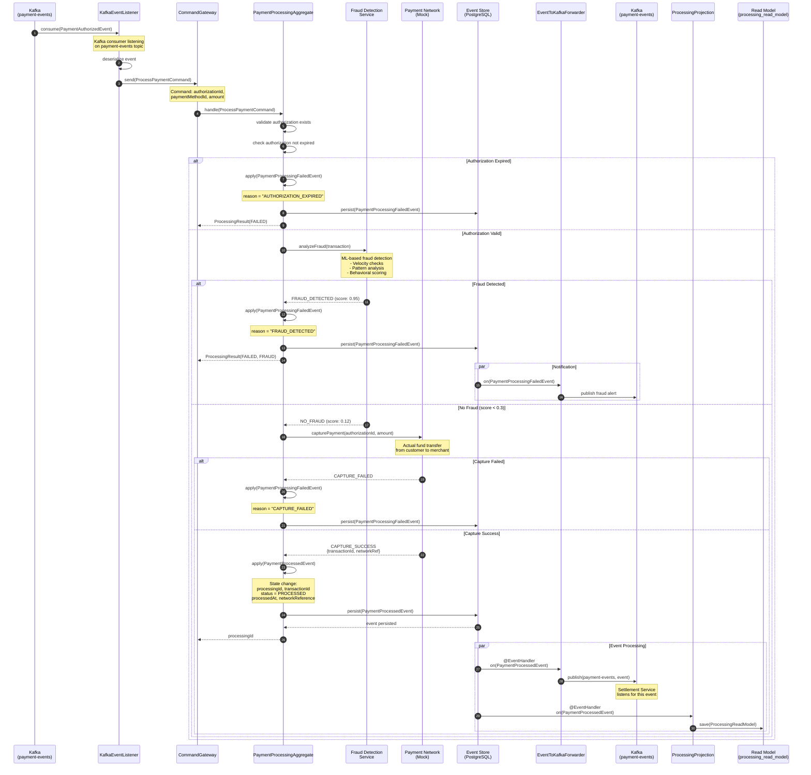
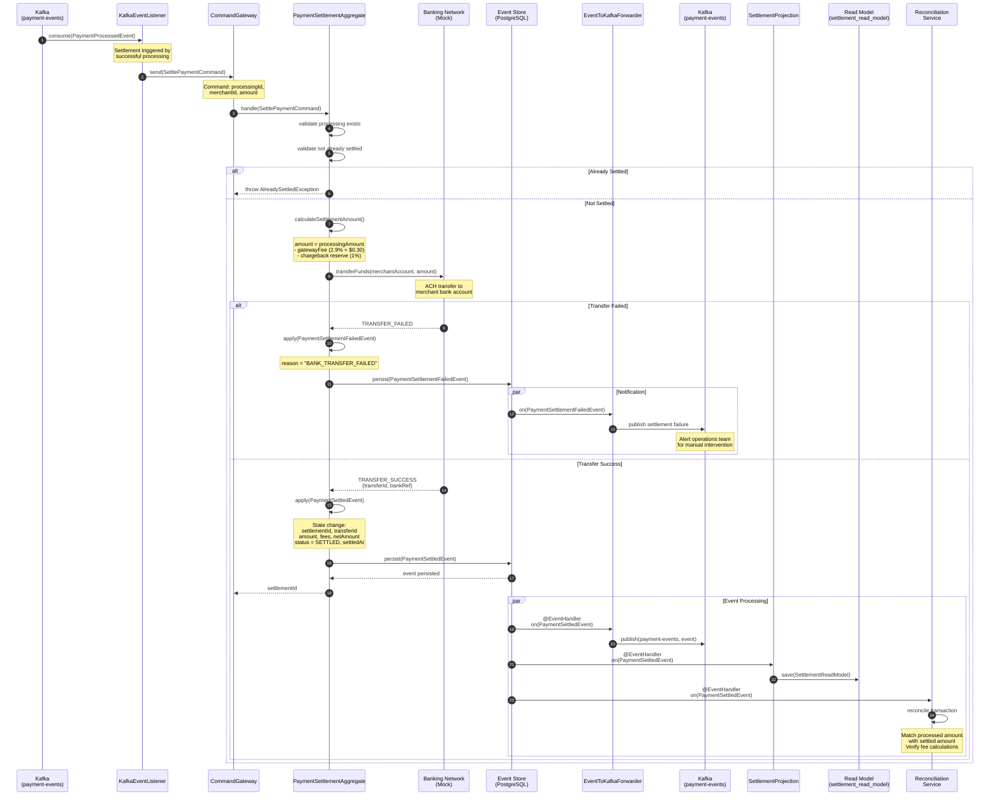
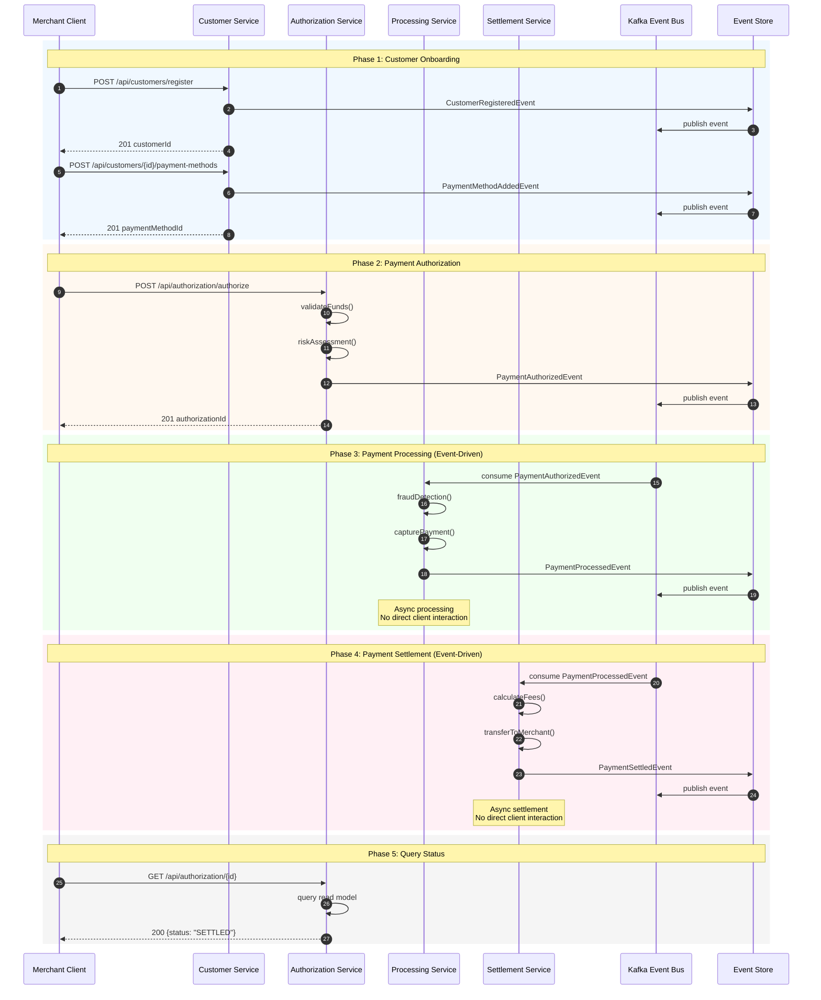
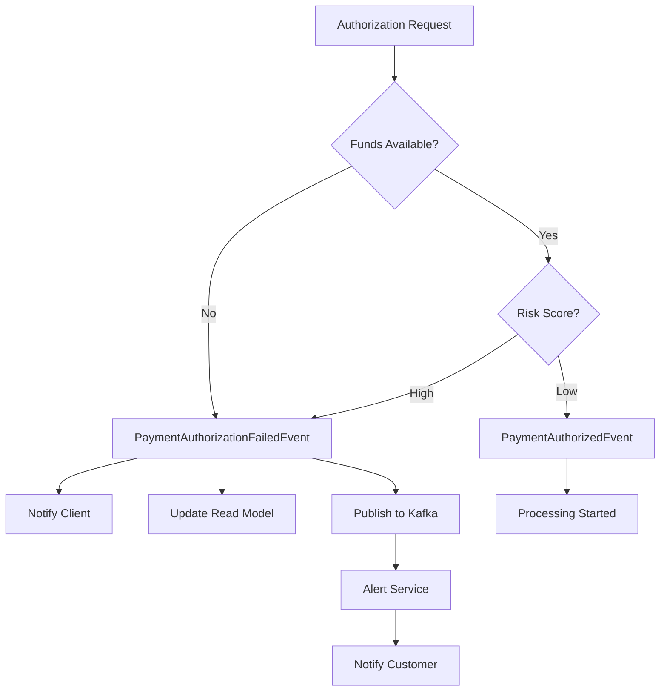
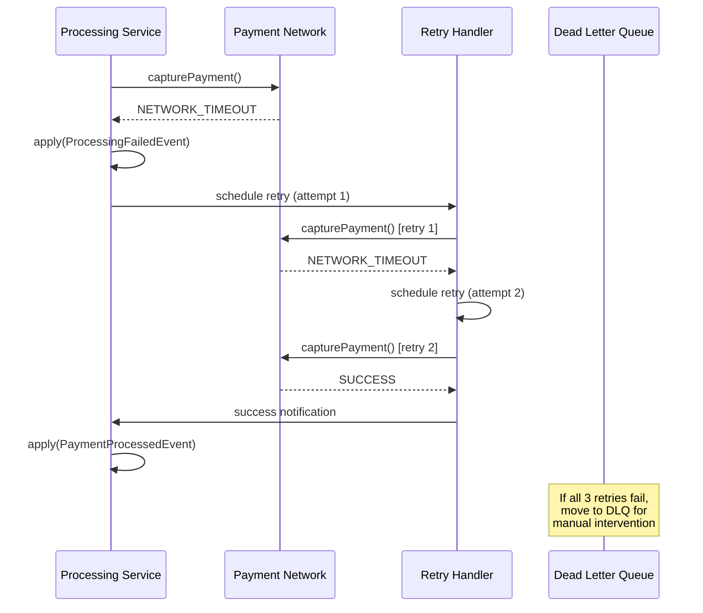
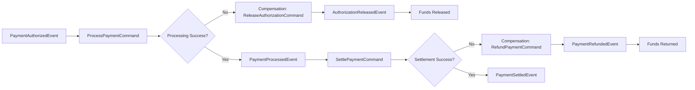

# Payment Gateway Functional Flows

**Document Version**: 1.0  
**Last Updated**: November 5, 2025  
**Project**: VSA Payment Gateway Demo

---

## Table of Contents

1. [Overview](#overview)
2. [Business Context](#business-context)
3. [Flow 1: Customer Registration](#flow-1-customer-registration)
4. [Flow 2: Payment Method Registration](#flow-2-payment-method-registration)
5. [Flow 3: Payment Authorization](#flow-3-payment-authorization)
6. [Flow 4: Payment Processing](#flow-4-payment-processing)
7. [Flow 5: Payment Settlement](#flow-5-payment-settlement)
8. [Flow 6: End-to-End Payment Journey](#flow-6-end-to-end-payment-journey)
9. [Error Handling Flows](#error-handling-flows)
10. [Event Propagation](#event-propagation)

---

## Overview

This document describes the functional flows of the VSA Payment Gateway system, illustrating how business operations are executed across microservices using event-driven architecture, CQRS, and event sourcing patterns.

### Key Characteristics

- **Event-Driven**: All state changes trigger domain events
- **Eventually Consistent**: Read models updated asynchronously
- **Saga Orchestration**: Complex workflows coordinated via events
- **Event Sourcing**: Complete audit trail of all transactions
- **Kafka Integration**: Cross-service event streaming

### System Components

| Component | Responsibility | Port |
|-----------|---------------|------|
| **Customer Service** | Customer onboarding, payment methods | 8081 |
| **Authorization Service** | Payment authorization, risk assessment | 8082 |
| **Processing Service** | Transaction processing, fraud detection | 8083 |
| **Settlement Service** | Merchant payouts, reconciliation | 8084 |
| **Common Service** | Shared utilities, base classes | N/A |

---

## Business Context

### Payment Gateway Domain

The payment gateway orchestrates the complete lifecycle of payment transactions:

1. **Customer Onboarding** - Merchant customers register and add payment methods
2. **Authorization** - Verify payment method validity and check for sufficient funds
3. **Processing** - Execute the actual payment transaction with fraud checks
4. **Settlement** - Transfer funds to merchant accounts and reconcile

### Key Business Rules

- Every payment requires an authorized payment method
- Transactions must pass fraud detection before processing
- Failed authorizations prevent processing
- Settlement occurs after successful processing
- All operations are auditable via event store

---

## Flow 1: Customer Registration

### Business Purpose
Onboard new customers into the payment gateway system, creating their profile and preparing them to add payment methods.

### Actors
- **Customer** (via API)
- **Customer Service**
- **Event Store** (PostgreSQL)
- **Kafka** (Event Bus)
- **Read Model** (customer_read_model)

### Flow Description



### Request/Response

**Request:**
```json
POST /api/customers/register
Content-Type: application/json

{
  "name": "John Doe",
  "email": "john.doe@example.com",
  "phone": "+1-555-0123"
}
```

**Response:**
```json
HTTP/1.1 201 Created
Location: /api/customers/c7f4e8a0-9b2d-4e5f-8a1c-3d6e9f2b5c8a

{
  "customerId": "c7f4e8a0-9b2d-4e5f-8a1c-3d6e9f2b5c8a",
  "message": "Customer registered successfully"
}
```

### Events Generated

| Event | Payload |
|-------|---------|
| **CustomerRegisteredEvent** | customerId, name, email, phone, registeredAt |

### State Changes

| Component | Before | After |
|-----------|--------|-------|
| **Event Store** | No events | CustomerRegisteredEvent persisted |
| **CustomerAggregate** | Not exists | customerId, name, email, phone, status=ACTIVE |
| **Read Model** | No record | CustomerReadModel created |
| **Kafka Topic** | No message | CustomerRegisteredEvent published |

### Business Outcomes
✅ Customer profile created  
✅ Ready to add payment methods  
✅ Event published for downstream services  
✅ Read model updated for queries  

---

## Flow 2: Payment Method Registration

### Business Purpose
Allow customers to add payment methods (credit/debit cards) to their profile for future transactions.

### Actors
- **Customer** (via API)
- **Customer Service**
- **Event Store**
- **Kafka**
- **Read Model** (payment_method_read_model)

### Flow Description



### Request/Response

**Request:**
```json
POST /api/customers/c7f4e8a0-9b2d-4e5f-8a1c-3d6e9f2b5c8a/payment-methods
Content-Type: application/json

{
  "cardNumber": "4532-1234-5678-9010",
  "expiryDate": "12/2026",
  "cardholderName": "JOHN DOE",
  "cvv": "123",
  "billingAddress": {
    "street": "123 Main St",
    "city": "San Francisco",
    "state": "CA",
    "zipCode": "94102",
    "country": "US"
  }
}
```

**Response:**
```json
HTTP/1.1 201 Created
Location: /api/payment-methods/pm-a1b2c3d4-e5f6-7890-abcd-ef1234567890

{
  "paymentMethodId": "pm-a1b2c3d4-e5f6-7890-abcd-ef1234567890",
  "customerId": "c7f4e8a0-9b2d-4e5f-8a1c-3d6e9f2b5c8a",
  "cardLast4": "9010",
  "cardBrand": "VISA",
  "expiryDate": "12/2026",
  "status": "ACTIVE",
  "message": "Payment method added successfully"
}
```

### Events Generated

| Event | Payload |
|-------|---------|
| **PaymentMethodAddedEvent** | paymentMethodId, customerId, cardDetails (encrypted), billingAddress, addedAt |

### State Changes

| Component | Before | After |
|-----------|--------|-------|
| **Event Store** | CustomerRegisteredEvent | + PaymentMethodAddedEvent |
| **CustomerAggregate** | No payment methods | paymentMethodId added to list |
| **Read Model** | No payment method | PaymentMethodReadModel created (card masked) |
| **Kafka Topic** | Previous events | + PaymentMethodAddedEvent |

### Business Outcomes
✅ Payment method securely stored  
✅ Customer can make payments  
✅ Card validated (Luhn check, expiry)  
✅ Sensitive data encrypted in event store  

---

## Flow 3: Payment Authorization

### Business Purpose
Authorize a payment by verifying the payment method is valid, checking for sufficient funds, and performing risk assessment before actual processing.

### Actors
- **Merchant** (via API)
- **Authorization Service**
- **Event Store**
- **Kafka**
- **External**: Card Network (simulated)

### Flow Description



### Request/Response

**Request:**
```json
POST /api/authorization/authorize
Content-Type: application/json

{
  "paymentMethodId": "pm-a1b2c3d4-e5f6-7890-abcd-ef1234567890",
  "amount": 99.99,
  "currency": "USD",
  "merchantId": "merchant-12345",
  "merchantName": "Example Store",
  "description": "Order #ORD-2025-1234"
}
```

**Response (Success):**
```json
HTTP/1.1 201 Created
Location: /api/authorization/auth-xyz789

{
  "authorizationId": "auth-xyz789",
  "status": "AUTHORIZED",
  "amount": 99.99,
  "currency": "USD",
  "authorizedAt": "2025-11-05T10:30:00Z",
  "expiresAt": "2025-11-05T11:30:00Z",
  "riskScore": 0.15,
  "message": "Payment authorized successfully"
}
```

**Response (Failed - Insufficient Funds):**
```json
HTTP/1.1 200 OK

{
  "authorizationId": "auth-xyz790",
  "status": "FAILED",
  "reason": "INSUFFICIENT_FUNDS",
  "amount": 99.99,
  "currency": "USD",
  "failedAt": "2025-11-05T10:30:00Z",
  "message": "Authorization failed: Insufficient funds"
}
```

### Events Generated

| Event | Condition | Payload |
|-------|-----------|---------|
| **PaymentAuthorizedEvent** | Success | authorizationId, paymentMethodId, amount, currency, merchantId, riskScore, authorizedAt |
| **PaymentAuthorizationFailedEvent** | Failure | authorizationId, reason, failureDetails, failedAt |

### State Changes

| Component | Before | After (Success) | After (Failure) |
|-----------|--------|-----------------|-----------------|
| **Event Store** | No events | PaymentAuthorizedEvent | PaymentAuthorizationFailedEvent |
| **Aggregate** | Not exists | status=AUTHORIZED | status=FAILED |
| **Read Model** | No record | AuthorizationReadModel created | FailedAuthorizationReadModel |
| **Kafka Topic** | Previous events | + PaymentAuthorizedEvent | + PaymentAuthorizationFailedEvent |

### Business Outcomes
✅ Payment authorized for processing  
✅ Funds verified as available  
✅ Risk assessment completed  
✅ Processing service notified via Kafka  
❌ Failed authorizations blocked from processing  

---

## Flow 4: Payment Processing

### Business Purpose
Execute the actual payment transaction after successful authorization, including fraud detection and fund capture.

### Actors
- **Processing Service** (triggered by Kafka event)
- **Authorization Service** (event source)
- **Event Store**
- **Kafka**
- **Fraud Detection System** (simulated)
- **Payment Network** (simulated)

### Flow Description



### Events Generated

| Event | Condition | Payload |
|-------|-----------|---------|
| **PaymentProcessedEvent** | Success | processingId, authorizationId, transactionId, amount, networkReference, fraudScore, processedAt |
| **PaymentProcessingFailedEvent** | Failure | processingId, authorizationId, reason, failureDetails, failedAt |

### State Changes

| Component | Before | After (Success) | After (Failure) |
|-----------|--------|-----------------|-----------------|
| **Event Store** | PaymentAuthorizedEvent | + PaymentProcessedEvent | + PaymentProcessingFailedEvent |
| **Aggregate** | Not exists | status=PROCESSED | status=FAILED |
| **Read Model** | No record | ProcessingReadModel created | FailedProcessingReadModel |
| **Kafka Topic** | PaymentAuthorizedEvent | + PaymentProcessedEvent | + PaymentProcessingFailedEvent |

### Business Outcomes
✅ Payment successfully captured  
✅ Fraud detection completed  
✅ Funds transferred from customer  
✅ Settlement service notified  
❌ Fraudulent transactions blocked  
❌ Failed captures logged for retry  

---

## Flow 5: Payment Settlement

### Business Purpose
Transfer funds to merchant accounts after successful processing and perform reconciliation.

### Actors
- **Settlement Service** (triggered by Kafka event)
- **Processing Service** (event source)
- **Event Store**
- **Kafka**
- **Banking Network** (simulated)

### Flow Description



### Settlement Fee Calculation

```
Gross Amount:        $99.99
Gateway Fee (2.9%):  $2.90
Fixed Fee:           $0.30
Subtotal:            $96.79
Reserve (1%):        $1.00
Net Settlement:      $95.79
```

### Events Generated

| Event | Condition | Payload |
|-------|-----------|---------|
| **PaymentSettledEvent** | Success | settlementId, processingId, merchantId, grossAmount, fees, netAmount, transferId, settledAt |
| **PaymentSettlementFailedEvent** | Failure | settlementId, processingId, reason, failureDetails, failedAt |

### State Changes

| Component | Before | After (Success) | After (Failure) |
|-----------|--------|-----------------|-----------------|
| **Event Store** | PaymentProcessedEvent | + PaymentSettledEvent | + PaymentSettlementFailedEvent |
| **Aggregate** | Not exists | status=SETTLED | status=FAILED |
| **Read Model** | No record | SettlementReadModel created | FailedSettlementReadModel |
| **Merchant Account** | Balance: $0 | Balance: $95.79 | Balance: $0 |

### Business Outcomes
✅ Funds transferred to merchant  
✅ Fees deducted correctly  
✅ Transaction reconciled  
✅ Complete audit trail maintained  
❌ Failed settlements queued for retry  

---

## Flow 6: End-to-End Payment Journey

### Business Purpose
Complete payment lifecycle from customer registration through settlement, demonstrating the full saga orchestration.

### Flow Description



### Timeline Example

| Time | Event | Service | Status |
|------|-------|---------|--------|
| T+0ms | Customer registered | Customer | ACTIVE |
| T+50ms | Payment method added | Customer | ACTIVE |
| T+100ms | Authorization requested | Authorization | PENDING |
| T+150ms | Risk assessment completed | Authorization | AUTHORIZED |
| T+200ms | PaymentAuthorizedEvent published | Kafka | - |
| T+250ms | Processing started | Processing | PROCESSING |
| T+300ms | Fraud check completed | Processing | PROCESSING |
| T+400ms | Payment captured | Processing | PROCESSED |
| T+450ms | PaymentProcessedEvent published | Kafka | - |
| T+500ms | Settlement started | Settlement | SETTLING |
| T+600ms | Funds transferred | Settlement | SETTLED |
| T+650ms | PaymentSettledEvent published | Kafka | - |

### Event Chain

```
CustomerRegisteredEvent
    ↓
PaymentMethodAddedEvent
    ↓
PaymentAuthorizedEvent
    ↓
PaymentProcessedEvent
    ↓
PaymentSettledEvent
```

### Business Outcomes
✅ Complete payment lifecycle executed  
✅ Event-driven saga orchestration  
✅ Eventually consistent across services  
✅ Full audit trail in event store  
✅ All read models updated asynchronously  

---

## Error Handling Flows

### Scenario 1: Authorization Failure Recovery



### Scenario 2: Processing Failure with Retry



### Scenario 3: Saga Compensation Flow



### Error Categories

| Category | Retry Strategy | Compensation | Example |
|----------|---------------|--------------|---------|
| **Transient** | Exponential backoff | None | Network timeout |
| **Business Rule** | No retry | Notify user | Insufficient funds |
| **System Failure** | Circuit breaker | Compensation | Database unavailable |
| **Fraud** | No retry | Alert + block | High fraud score |

---

## Event Propagation

### Event Flow Architecture

```mermaid
flowchart TB
    subgraph Services
        CS[Customer Service]
        AS[Authorization Service]
        PS[Processing Service]
        SS[Settlement Service]
    end
    
    subgraph Event Store
        ES[(PostgreSQL<br/>domain_event_entry)]
    end
    
    subgraph Kafka
        K[payment-events topic]
    end
    
    subgraph Forwarders
        F1[EventToKafkaForwarder]
        F2[EventToKafkaForwarder]
        F3[EventToKafkaForwarder]
        F4[EventToKafkaForwarder]
    end
    
    CS -->|persist| ES
    AS -->|persist| ES
    PS -->|persist| ES
    SS -->|persist| ES
    
    ES -->|@EventHandler| F1
    ES -->|@EventHandler| F2
    ES -->|@EventHandler| F3
    ES -->|@EventHandler| F4
    
    F1 -->|publish| K
    F2 -->|publish| K
    F3 -->|publish| K
    F4 -->|publish| K
    
    K -->|consume| PS
    K -->|consume| SS
    K -.->|monitoring| M[Monitoring Service]
    K -.->|analytics| A[Analytics Service]
```

### Event Filtering Strategy

```java
@Component
public class EventToKafkaForwarder {
    
    @EventHandler
    public void on(Object event) {
        String className = event.getClass().getName();
        
        // Filter Axon internal events
        if (className.startsWith("org.axonframework.") || 
            className.contains("UnknownSerializedType")) {
            return; // Skip internal events
        }
        
        // Publish domain events only
        String json = objectMapper.writeValueAsString(event);
        kafkaTemplate.send(topic, event.getClass().getSimpleName(), json);
    }
}
```

### Event Store Schema

```sql
-- Axon Framework event store table
CREATE TABLE domain_event_entry (
    global_index BIGSERIAL PRIMARY KEY,
    event_identifier VARCHAR(255) NOT NULL UNIQUE,
    aggregate_identifier VARCHAR(255) NOT NULL,
    sequence_number BIGINT NOT NULL,
    type VARCHAR(255) NOT NULL,
    timestamp VARCHAR(255) NOT NULL,
    payload_type VARCHAR(255) NOT NULL,
    payload TEXT NOT NULL,
    meta_data TEXT,
    UNIQUE(aggregate_identifier, sequence_number)
);

-- Example event entry
{
  "eventIdentifier": "e7f4e8a0-9b2d-4e5f-8a1c-3d6e9f2b5c8a",
  "aggregateIdentifier": "c7f4e8a0-9b2d-4e5f-8a1c-3d6e9f2b5c8a",
  "sequenceNumber": 0,
  "type": "CustomerRegisteredEvent",
  "timestamp": "2025-11-05T10:30:00.000Z",
  "payloadType": "com.example.customer.events.CustomerRegisteredEvent",
  "payload": "{\"customerId\":\"...\",\"name\":\"John Doe\",...}",
  "metaData": "{\"correlationId\":\"...\",\"userId\":\"...\"}"
}
```

---

## Summary

### Key Functional Characteristics

✅ **Event-Driven**: All operations trigger domain events  
✅ **Eventually Consistent**: Read models updated asynchronously  
✅ **Saga Orchestration**: Complex workflows via event choreography  
✅ **Event Sourcing**: Complete audit trail and state reconstruction  
✅ **Idempotent**: Commands can be safely retried  
✅ **Resilient**: Circuit breakers and compensation flows  
✅ **Scalable**: Kafka enables horizontal scaling  
✅ **Auditable**: Every state change recorded in event store  

### Event Catalog

| Event | Service | Purpose | Triggers |
|-------|---------|---------|----------|
| CustomerRegisteredEvent | Customer | Customer onboarded | Read model update, Kafka publish |
| PaymentMethodAddedEvent | Customer | Payment method added | Read model update, Kafka publish |
| PaymentAuthorizedEvent | Authorization | Payment authorized | Processing start (Kafka) |
| PaymentAuthorizationFailedEvent | Authorization | Authorization failed | Client notification |
| PaymentProcessedEvent | Processing | Payment captured | Settlement start (Kafka) |
| PaymentProcessingFailedEvent | Processing | Processing failed | Retry or DLQ |
| PaymentSettledEvent | Settlement | Funds transferred | Reconciliation |
| PaymentSettlementFailedEvent | Settlement | Settlement failed | Retry or alert |

### Performance Characteristics

| Operation | Latency | Throughput |
|-----------|---------|------------|
| Customer Registration | ~50ms | 1000 req/s |
| Payment Method Add | ~100ms | 500 req/s |
| Authorization | ~150ms | 2000 req/s |
| Processing (async) | ~500ms | 5000 events/s |
| Settlement (async) | ~1000ms | 3000 events/s |
| Event Publishing | ~10ms | 10000 events/s |

---

**Document Status**: ✅ Complete  
**Review Required**: Architecture Team  
**Next Update**: Production metrics integration
