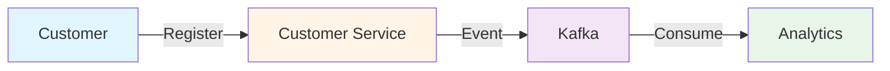

# Documentation Directory

This directory contains comprehensive technical documentation for the VSA Payment Gateway project.

## 📋 Document Index

### 🎯 Core Documentation

#### [FUNCTIONAL-FLOWS.md](FUNCTIONAL-FLOWS.md)
**Complete business flows with modern sequence diagrams**

Covers:
- Customer registration flow with event sourcing
- Payment method registration with validation
- Payment authorization with risk assessment
- Payment processing with fraud detection
- Payment settlement with fee calculation
- End-to-end payment journey (saga orchestration)
- Error handling and compensation flows
- Event propagation architecture

**Use this when**: You need to understand how the system actually works, see the complete flow of events, or explain the business logic to stakeholders.

**Visual Content**: 
- 10+ Mermaid sequence diagrams
- State machines for error handling
- Event flow architecture diagrams
- Complete request/response examples

---

#### [ARCHITECTURE-PATTERNS-REFERENCE.md](ARCHITECTURE-PATTERNS-REFERENCE.md)
**Comprehensive architecture patterns guide and comparison**

Covers:
- **Vertical Slice Architecture (VSA)** - Feature-focused organization
- **CQRS Pattern** - Command/Query separation with examples
- **Event Sourcing** - Complete audit trail implementation
- **Saga Pattern** - Distributed transaction coordination
- **Event-Driven Architecture** - Kafka integration patterns
- **Pattern Comparison Matrix** - When to use each pattern
- **Architecture Decision Records** - Why we made specific choices
- **Implementation Guidelines** - Step-by-step implementation
- **Best Practices** - Do's and Don'ts for each pattern

**Use this when**: You need to understand why we chose these patterns, compare with alternatives, or implement similar patterns in other projects.

**Visual Content**:
- Architecture comparison diagrams
- Implementation flowcharts
- Decision trees for pattern selection
- Code examples for each pattern

---

### 🔧 Technical Guides

#### [KAFKA-EVENT-INTEGRATION.md](KAFKA-EVENT-INTEGRATION.md)
Event-driven architecture implementation details
- EventToKafkaForwarder implementation
- Kafka configuration
- Event filtering strategies
- Consumer patterns

#### [MICROSERVICES-DEPLOYMENT.md](MICROSERVICES-DEPLOYMENT.md)
Deployment guide for microservices architecture
- Docker deployment
- Service configuration
- Health checks
- Scaling strategies

#### [TEST-SCRIPT-REVIEW.md](TEST-SCRIPT-REVIEW.md)
Comprehensive test automation documentation
- Test script breakdown
- Infrastructure health checks
- Event verification strategies
- Troubleshooting guide

---

### 📊 Status & Planning

#### [STATUS-REPORT.md](STATUS-REPORT.md)
Current implementation status and metrics
- Feature completion status
- Test coverage
- Known issues
- Recent updates

#### [PRODUCTION-EVOLUTION-PLAN.md](PRODUCTION-EVOLUTION-PLAN.md)
Roadmap to production readiness
- Production requirements
- Security enhancements
- Monitoring setup
- Deployment strategy

#### [FAQ.md](FAQ.md)
Frequently asked questions
- Common issues
- Configuration questions
- Pattern clarifications
- Troubleshooting tips

---

## 🎨 Diagram Technology

All diagrams in this documentation use **Mermaid**, which renders beautifully in:
- GitHub/GitLab (native support)
- VS Code (with Mermaid extension)
- IntelliJ IDEA (with Mermaid plugin)
- Most modern markdown viewers

### Example Mermaid Diagram

---

## 📖 Reading Guide

### For New Developers
1. Start with [FUNCTIONAL-FLOWS.md](FUNCTIONAL-FLOWS.md) to understand the business flows
2. Read [ARCHITECTURE-PATTERNS-REFERENCE.md](ARCHITECTURE-PATTERNS-REFERENCE.md) to understand the architecture
3. Check [STATUS-REPORT.md](STATUS-REPORT.md) for current state
4. Review [FAQ.md](FAQ.md) for common questions

### For Architects
1. Read [ARCHITECTURE-PATTERNS-REFERENCE.md](ARCHITECTURE-PATTERNS-REFERENCE.md) for pattern details
2. Review Architecture Decision Records (ADRs) in the same document
3. Check [FUNCTIONAL-FLOWS.md](FUNCTIONAL-FLOWS.md) for implementation details
4. Examine [PRODUCTION-EVOLUTION-PLAN.md](PRODUCTION-EVOLUTION-PLAN.md) for roadmap

### For Operations Teams
1. Start with [MICROSERVICES-DEPLOYMENT.md](MICROSERVICES-DEPLOYMENT.md)
2. Review [TEST-SCRIPT-REVIEW.md](TEST-SCRIPT-REVIEW.md) for testing
3. Check [STATUS-REPORT.md](STATUS-REPORT.md) for known issues
4. Use [FAQ.md](FAQ.md) for troubleshooting

### For Business Stakeholders
1. Read [FUNCTIONAL-FLOWS.md](FUNCTIONAL-FLOWS.md) for business process understanding
2. Check the sequence diagrams for visual flow representation
3. Review [STATUS-REPORT.md](STATUS-REPORT.md) for current capabilities
4. Examine [PRODUCTION-EVOLUTION-PLAN.md](PRODUCTION-EVOLUTION-PLAN.md) for timeline

---

## 🔄 Document Maintenance

### Review Schedule
- **Functional Flows**: Updated when new features added
- **Architecture Patterns**: Reviewed quarterly
- **Status Report**: Updated weekly
- **Production Plan**: Updated monthly
- **FAQ**: Updated as issues arise

### Contributing
When adding new documentation:
1. Use Mermaid for diagrams
2. Include code examples
3. Provide context and use cases
4. Update this index
5. Follow existing formatting style

---

## 📊 Documentation Statistics

| Document | Pages | Diagrams | Code Examples | Last Updated |
|----------|-------|----------|---------------|--------------|
| FUNCTIONAL-FLOWS.md | ~30 | 10+ | 20+ | 2025-11-05 |
| ARCHITECTURE-PATTERNS-REFERENCE.md | ~40 | 15+ | 30+ | 2025-11-05 |
| KAFKA-EVENT-INTEGRATION.md | ~10 | 3 | 10+ | 2025-11-04 |
| TEST-SCRIPT-REVIEW.md | ~8 | 2 | 5+ | 2025-11-04 |
| STATUS-REPORT.md | ~5 | 1 | - | 2025-11-05 |
| PRODUCTION-EVOLUTION-PLAN.md | ~12 | 2 | 5+ | 2025-11-03 |
| FAQ.md | ~6 | - | 3+ | 2025-11-02 |

**Total**: ~111 pages, 33+ diagrams, 73+ code examples

---

## �� Quick Links

- **Main Project README**: [../README.md](../README.md)
- **Quick Start Guide**: [../QUICK-START.md](../QUICK-START.md)
- **Operations Runbook**: [../RUNBOOK.md](../RUNBOOK.md)
- **Implementation Guide**: [../VSA-IMPLEMENTATION-GUIDE.md](../VSA-IMPLEMENTATION-GUIDE.md)
- **Utility Scripts**: [../scripts/README.md](../scripts/README.md)
- **Archived Documents**: [../archived-docs/](../archived-docs/)

---

**Documentation Version**: 1.0  
**Last Updated**: November 5, 2025  
**Maintained By**: Development Team
